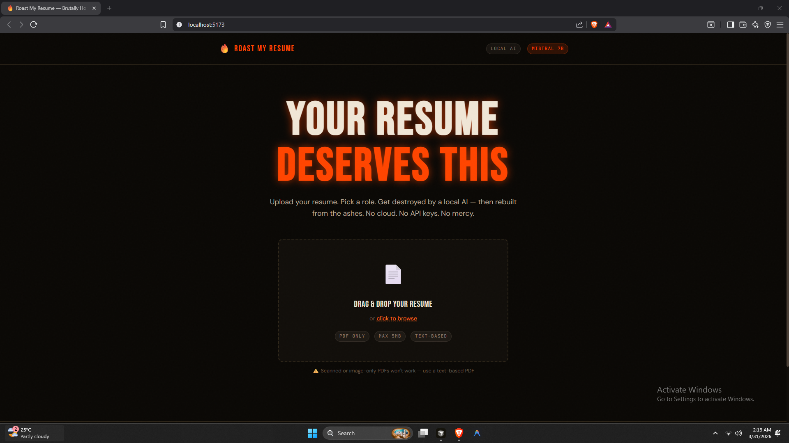
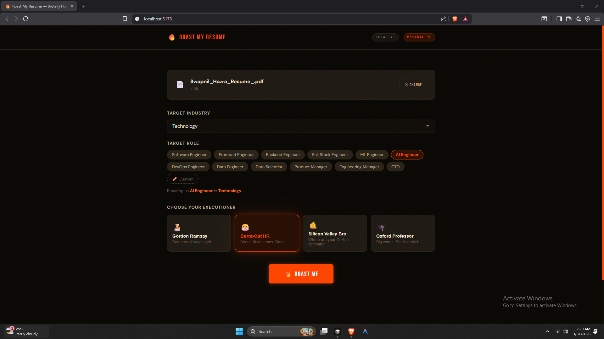
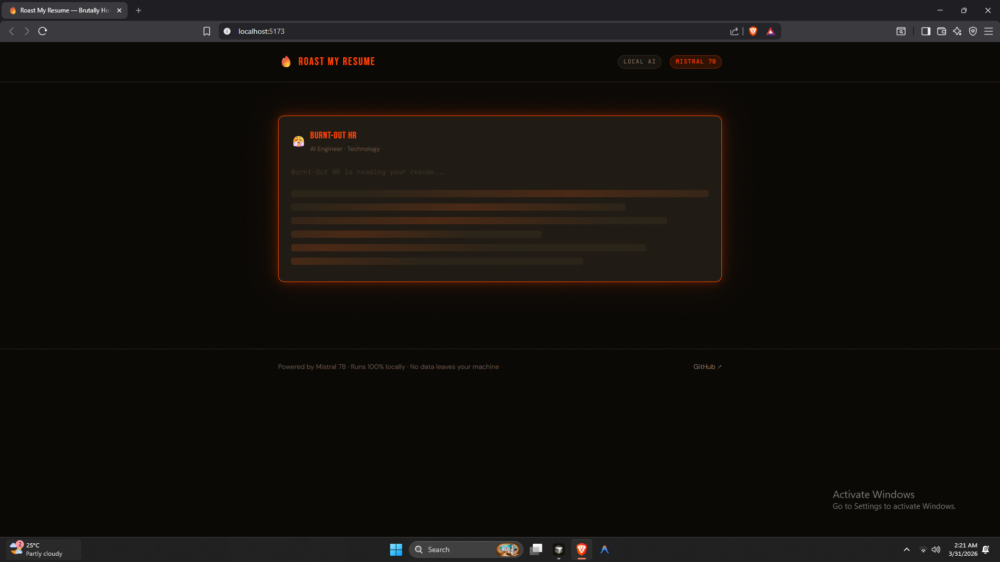
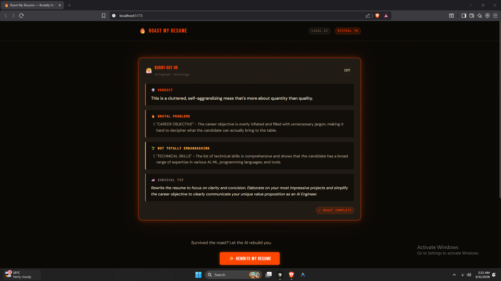

# 🔥 Roast My Resume

> **Upload your resume. Pick a role. Get destroyed — then rebuilt — by a local AI.**
> No cloud. No API keys. No mercy.



---

## 🎯 What Is This?

**Roast My Resume** is a brutally honest AI resume reviewer that runs **100% on your local machine**.

You upload a PDF resume, pick your target role and industry, choose your executioner persona — and a locally hosted Mistral 7B model tears your resume apart, then rewrites it from scratch. Token by token. Live on screen. No OpenAI. No Anthropic. No cloud. Just raw, local intelligence and zero mercy.

Built as part of the **#100DaysOfVibeCoding** challenge.

---

## ✨ Features

- 🔥 **Brutal AI Roast** — Structured feedback: Verdict → Problems → Not Terrible → Survival Tip
- ✍️ **Full Resume Rewrite** — Rebuilt with action verbs, metrics, and ATS-friendly formatting
- 🎭 **4 Roast Personas** — Gordon Ramsay · Burnt-Out HR · Silicon Valley Bro · Oxford Professor
- ⚡ **Real-time Streaming** — Token-by-token output, no 45-second spinner
- 📊 **Resume Stats** — Word count, action verb count, metric density analysis
- 🧠 **100% Local** — Mistral 7B via Ollama. Your resume never leaves your machine
- 📄 **Smart PDF Parser** — Extracts text, detects scanned PDFs, validates before processing
- 🎨 **Scorched-Earth UI** — Dark theme, Bebas Neue typography, fire glow effects
- 💾 **Download Rewrite** — Save the rebuilt resume as a `.txt` file instantly

---

## 📸 Screenshots

### Landing Page


### Role & Persona Selection


### Live Roast Streaming


### Structured Roast Result


---

## 🏗️ Architecture

```
┌─────────────────────────────────────────────────────┐
│                    Browser (React)                   │
│                                                      │
│   UploadZone → RoleSelector → RoastCard              │
│                             → RewriteCard            │
└──────────────────────┬──────────────────────────────┘
                       │ HTTP + SSE Streaming
                       ▼
┌─────────────────────────────────────────────────────┐
│                  FastAPI Backend                      │
│                                                      │
│   /roast    → pdfplumber → stream_roast()            │
│   /rewrite  → pdfplumber → stream_rewrite()          │
│   /health   → status check                          │
│   /models   → ollama model list                      │
└──────────────────────┬──────────────────────────────┘
                       │ REST API
                       ▼
┌─────────────────────────────────────────────────────┐
│              Ollama (Local LLM Runtime)              │
│                                                      │
│              mistral:7b-instruct                     │
│         Runs on your GPU · Zero cloud calls          │
└─────────────────────────────────────────────────────┘
```

---

## 🛠️ Tech Stack

| Layer | Technology |
|---|---|
| Frontend | React 18 · Vite · Framer Motion |
| Styling | Custom CSS Design System (no Tailwind) |
| Backend | FastAPI · Uvicorn |
| PDF Parsing | pdfplumber |
| LLM Runtime | Ollama |
| Model | mistral:7b-instruct (4.4GB) |
| Streaming | Server-Sent Events (SSE) |

---

## 🚀 Getting Started

### Prerequisites

- Python 3.10+
- Node.js 18+
- [Ollama](https://ollama.ai) installed and running
- Mistral 7B pulled locally

### 1. Pull the model

```bash
ollama pull mistral:7b-instruct
```

### 2. Clone the repo

```bash
git clone https://github.com/Swapnil-bo/Roast-My-Resume.git
cd Roast-My-Resume
```

### 3. Start the backend

```bash
cd backend
pip install -r requirements.txt
uvicorn main:app --reload
```

Backend runs on `http://localhost:8000`

### 4. Start the frontend

```bash
cd frontend
npm install
npm run dev
```

Frontend runs on `http://localhost:5173`

### 5. Make sure Ollama is running

```bash
ollama serve
```

Open `http://localhost:5173` and upload your resume. Prepare for pain. 🔥

---

## 🎭 Roast Personas

| Persona | Vibe |
|---|---|
| 👨‍🍳 Gordon Ramsay | Screams (metaphorically). Devastates. Always right. |
| 😤 Burnt-Out HR | Seen 10,000 resumes. Has completely lost patience. |
| 🤙 Silicon Valley Bro | Judges everything by GitHub commits and startup metrics. |
| 🎓 Oxford Professor | Uses big words to deliver very small verdicts. |

---

## 📁 Project Structure

```
roast-my-resume/
│
├── backend/
│   ├── main.py          # FastAPI app, endpoints, PDF extraction
│   ├── roaster.py       # Ollama streaming logic, persona prompts
│   └── requirements.txt
│
├── frontend/
│   ├── index.html
│   └── src/
│       ├── components/
│       │   ├── UploadZone.jsx    # Drag & drop PDF upload
│       │   ├── RoleSelector.jsx  # Industry + role picker with chips
│       │   ├── RoastCard.jsx     # Streaming roast display + parser
│       │   └── RewriteCard.jsx   # Rewrite display + stats + download
│       ├── App.jsx       # 3-step flow, streaming logic
│       ├── main.jsx
│       └── index.css     # Full design system
│
└── README.md
```

---

## ⚠️ Known Limitations

- **Scanned PDFs won't work** — pdfplumber requires text-based PDFs. If your PDF is a scan or image, text extraction returns empty.
- **Generation speed depends on your GPU** — On an RTX 3050 6GB, expect ~20–40 seconds for a full roast.
- **Mistral may not always follow the structured format** — RoastCard falls back to raw text display gracefully if parsing fails.

---

## 🗺️ Roadmap

- [ ] Drag-to-compare: original vs rewritten resume side by side
- [ ] Score card: numerical rating per section (0–10)
- [ ] Export rewrite as PDF
- [ ] Support for additional local models (Qwen, DeepSeek)
- [ ] Share roast as image card (viral-ready)

---

## 👨‍💻 Built By

**Swapnil Hazra** — AI Engineer · Building in public · #100DaysOfVibeCoding

- 𝕏 [@SwapnilHazra4](https://twitter.com/SwapnilHazra4)
- 💼 [LinkedIn](https://linkedin.com/in/swapnil-hazra)
- 🐙 [GitHub @Swapnil-bo](https://github.com/Swapnil-bo)

---

## 📄 License

MIT — do whatever you want, just don't use it to roast someone else's resume without their consent.

---

<div align="center">

**No cloud. No API keys. No mercy.**

⭐ Star this repo if your resume survived the roast.

</div>